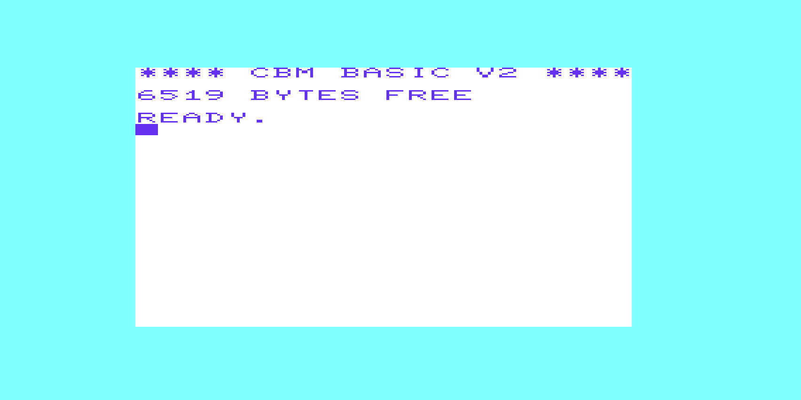

# Code Probe (VIC-20)


|||
|:---:|:---:|
|||

A machine language monitor for the Commodore VIC-20 and VIC-1211A Super Expander.

- Inspect and modify memory with a hex dump and interactive alter mode.
- View the CPU registers and processor status flags captured at the end of the last executed routine.
- Save and load machine language programs to and from tape, in PRG and SEQ formats.
- Loads at `$0480` inside the VIC-1211A Super Expander's 3 KiB expansion RAM and is invoked from BASIC with `SYS 1152`.

<br>

> *See Commodore 64 version, [here](https://github.com/rohingosling/code-probe-c64).*

## Overview

Code Probe is a software-based machine language monitor that runs in the 3 KiB expansion RAM of the **VIC-1211A Super Expander** cartridge and produces machine language programs that run on a stock unexpanded VIC-20 with no cartridge. The Super Expander must be inserted at boot; without it, there is no RAM at `$0480` for Code Probe to live in.

The design of Code Probe was inspired by the DOS `DEBUG` utility, and presents a similar terminal-style user interface and commands. All numeric input is hexadecimal. Addresses are 4 digits, byte values are 2 digits, file types are 2 digits.

### Features

- **Memory inspection** - Hex dump with PETSCII character display.
- **Memory editing** - Interactive alter mode with cursor navigation, auto-space between bytes, and auto-commit at five bytes per line.
- **Register display** - View A, X, Y, and P (with expanded flag bits) captured at the moment the most recent `G` command returned.
- **Program execution** - Run machine language programs via a JSR trampoline; the user routine returns to the monitor with `RTS`.
- **Tape I/O** - Save and load PRG and SEQ files to and from a Datasette. PRG files round-trip with the original load address; SEQ files carry raw bytes only.
- **Screen control** - Clear the display with a single command.
- **Exit to BASIC** - Return to BASIC's `READY.` prompt; re-enter Code Probe with `SYS 1152`.

## Loading and Starting

Code Probe loads at address `$0480` (1152 decimal) and occupies 2614 bytes of RAM in the `$0480`-`$0EB5` region of the Super Expander's expansion RAM. The full PRG file is 2743 bytes: a 13-byte BASIC stub at `$0401-$040D`, a zero-fill gap, the monitor body at `$0480-$0EB5`, plus the standard 2-byte PRG header. The native VIC-20 RAM at `$1001-$1DFF` is left free for user machine language programs.

### From Tape

```
LOAD "CODEPROBE",1,1
RUN
```

The `,1,1` parameter loads the program to the address stored in its PRG header (`$0401`), rather than to the default BASIC area on the expanded machine. `RUN` invokes the BASIC stub, which executes `SYS 1152` and transfers control to Code Probe. Alternatively, `SYS 1152` typed by hand at the BASIC prompt has the same effect.

### From the VICE Emulator

To launch `xvic` with the Super Expander cartridge attached, the 3 KiB Block 0 RAM enabled, and `build/code-probe.prg` autostarted into the monitor:

```bash
xvic -memory 3k -cartA roms/super-expander-a000.prg -autostart build/code-probe.prg
```

To boot a bare Super-Expanded VIC-20 without autostart, then attach a tape image inside VICE and load Code Probe by hand (`LOAD "CODEPROBE",1,1` followed by `RUN`):

```bash
xvic -memory 3k -cartA roms/super-expander-a000.prg
```

Run both commands from the `v1/` directory so the relative paths to `roms/` and `build/` resolve. `xvic` must be on `PATH`, or substitute the full path to your VICE install.

### What happens at startup

1. The screen border and background are set to black via VIC-I register `$900F`.
2. The KERNAL text colour at `$0286` is set to white.
3. The screen is cleared via `CHROUT $93`.
4. The title banner is displayed:

   ```
   CODE PROBE      (v1.1)
   ROHIN GOSLING   (1988)
   ```

5. A blank line separates the banner from the first prompt.
6. The monitor prompt loop begins.

   ```
   CODE PROBE      (v1.1)
   ROHIN GOSLING   (1988)

   : █
   ```

## Command Reference

All address and count values are hexadecimal. Addresses are 4 digits, byte values are 2 digits, file types are 2 digits. Command dispatch is single-character: `C`, `CLS`, and `CLEAR` all route to the clear-screen command; `E`, `EXIT`, and `END` all route to the exit-to-BASIC command.

| Command | Syntax                          | Description                                              |
|---------|---------------------------------|----------------------------------------------------------|
| `A`     | `A <address>`                   | Enter alter mode to write hex bytes to RAM.              |
| `D`     | `D <start> [<end>]`             | Hex dump memory from start to end (inclusive).           |
| `R`     | `R`                             | Display A, X, Y, and P (with expanded flag bits).        |
| `G`     | `G <address>`                   | Execute machine code at address; capture post-RTS regs.  |
| `S`     | `S <start> <end> <type>`        | Save tape file. `<type>` = `01` PRG, `00` SEQ.           |
| `L`     | `L <filename>`                  | Load PRG file (uses file's load address).                |
| `L`     | `L <filename> <address>`        | Load SEQ file to specified address.                      |
| `CLS`   | `CLS`                           | Clear the screen.                                        |
| `EXIT`  | `EXIT`                          | Exit to BASIC. Re-enter with `SYS 1152`.                 |

The `S` command splits across two lines: the first line names the address range and the file type, and the second line is an auto-prompted `FILE:` entry for the filename (up to 16 characters, unquoted). Splitting the filename off the command line means long names do not have to fit alongside three other tokens on the 22-column screen.

See [`docs/user-manual.pdf`](docs/user-manual.pdf) for the full user manual, including worked tutorials, the memory map, error messages, a quick reference card, and an appendix on attaching the Super Expander cartridge under VICE.

## Building From Source

Code Probe is a single-file assembly project built with [Kick Assembler](http://www.theweb.dk/KickAssembler/). Java is required.

**Assemble:**

```bash
java -jar KickAss.jar src/code-probe-vic-20.asm -odir build
```

The build produces `build/code-probe.prg` — a 2743-byte PRG that loads at `$0401` (the BASIC start of an unexpanded VIC-20). The same PRG runs on a physical VIC-20 with the VIC-1211A Super Expander cartridge inserted, and on the VICE emulator with the Super Expander ROM image attached.

### Running on a Physical VIC-20

Hardware required:

- A Commodore VIC-20 (PAL or NTSC).
- A **VIC-1211A Super Expander** cartridge inserted at boot. Code Probe loads at `$0480`, inside the cartridge's 3 KiB expansion RAM, and will not run without it.
- A means of transferring `build/code-probe.prg` from the build host to the VIC-20 — for example a Datasette with a PRG-to-WAV / PRG-to-TAP converter, an SD-card storage cartridge (SD2IEC, Penultimate Cartridge, Ultimate II), or a 1541 / 1541-II disk drive with a PRG-to-D64 toolchain.

With the Super Expander cartridge inserted and the PRG on tape, disk, or SD:

```
LOAD "CODEPROBE",1,1
RUN
```

The `,1,1` parameter forces the file to load at the address in its PRG header (`$0401`) rather than the default expanded-machine BASIC area. `RUN` invokes the embedded BASIC stub, which executes `SYS 1152` and transfers control to the monitor. `SYS 1152` typed by hand has the same effect.

### Running in VICE

```bash
xvic -memory 3k -cartA roms/super-expander-a000.prg -autostart build/code-probe.prg
```

Run from the `v1/` directory so the relative paths resolve. `xvic` must be on `PATH`, or substitute the full path to your VICE install (e.g. `C:\Programs\GTK3VICE-3.10-win64\bin\xvic.exe` on Windows, `/usr/bin/xvic` on most Linux distributions).

#### Super Expander ROM

The VIC-1211A Super Expander cartridge image is not redistributed in this repository. Download it from the Zimmers archive and place it at `roms/super-expander-a000.prg`:

[http://www.zimmers.net/anonftp/pub/cbm/vic20/roms/tools/4k/](http://www.zimmers.net/anonftp/pub/cbm/vic20/roms/tools/4k/)

The expected file is a 4098-byte PRG with a `$A000` load-address header (4096 bytes of ROM plus a 2-byte header).

> **Note:**<br>Two versions of the VIC-1211 Super Expander are available on zimmers.net. The `VIC1211m`, originally targeting the Japanese market in the 1980s, and the standard VIC-1211A, listed as `Super Expander.prg` on the download page. For Code Probe, download the standard VIC-1211A (`Super Expander.prg`) and rename it to `super-expander-a000.prg` so the `xvic -cartA` argument resolves. The `-a000` filename suffix is a VICE smart-attach hint.

## Tape Listing

Contents of the `code-probe.tap` tape image.

| File        | Type | Description                                                |
|-------------|------|------------------------------------------------------------|
| `CODEPROBE` | PRG  | Compiled Code Probe machine language monitor (v1.1).       |

The `dist/examples/` directory contains additional tape images used as round-trip test fixtures and tutorial subjects: `cube.tap` (a 3D rotating wireframe cube targeting the unexpanded VIC-20), and `hello.tap` / `hello2.tap` (minimal "hello world" greeters demonstrated in the user manual's tutorial chapter).

## Acknowledgements

| Tool                                                       | Author&nbsp;/&nbsp;Maintainer | Role in this project                                                                                          |
|------------------------------------------------------------|-------------------------------|---------------------------------------------------------------------------------------------------------------|
| [Kick&nbsp;Assembler](http://www.theweb.dk/KickAssembler/) | Mads&nbsp;Nielsen             | 6502 cross-assembler. Builds `codeprobe.prg` from `code-probe-vic-20.asm`.                                            |
| [VICE](https://vice-emu.sourceforge.io/)                   | The&nbsp;VICE&nbsp;Team       | Commodore emulator suite. `xvic` and `x64sc` for development and testing.                                     |
| [C64&nbsp;TrueType](https://style64.org/c64-truetype)      | STYLE                         | TrueType C64 font set. Used to typeset the user manual in an authentic Commodore style.                       |
| Claude&nbsp;Code                                           | Anthropic                     | AI coding assistant. Constructed the Kick Assembler listings from the original PRG binaries.                  |

## License

Copyright © 2026 Rohin Gosling.

Code Probe and its accompanying user manual are distributed under the [MIT License](LICENSE) — a permissive, free-software licence that allows use, modification, and redistribution (including commercial use), provided the copyright notice and licence text are preserved.

This is a personal retrocomputing project shared for historical and educational purposes.
